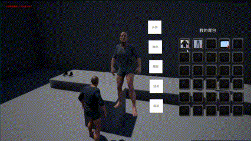
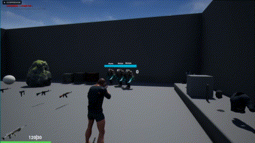

# TPSDemoUsingBP

## Demo介绍

使用蓝图制作的TPS Demo，通过使用数据表管理武器操作模式以及物品的具体属性；实现简易背包实现物品交互；多种枪械的不同射击模式（例如步枪、霰弹枪、榴弹枪等），实现点射与全自动的切换，实现爆炸范围伤害以及爆炸伤害递减；实现命中不同部位传递不同的伤害。

1. 通过在镜像角色上更换服装，同步更换操控人物的服装。

1. 实现背包中物品的交换，部分以及全部丢弃操作。

1. 通过在怪物肢体上使用不同的物理材质，可以在子弹接触获得此部位的物理材质，从而可以传递不同的伤害。
